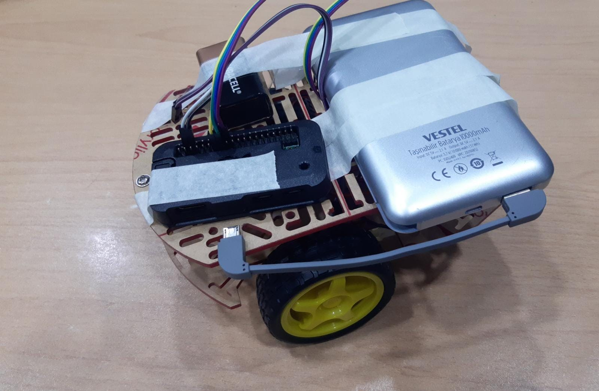

<p align="center">
  <a href="https://github.com/umutsevdi/mdp_bme4991">
  <h3 align="center">Eye Tracking Robot</h3>
  </a>

<p align="center">  
A robot that can move with the eye movements of the owner. 
  <br/>
    <i>Developed by <a href="https://github.com/umutsevdi">Umut Sevdi</a></i>, 
<p align="center"><a href="doc/Rapor.pdf"><strong>Explore the docs »
</strong></a></p>

<details open="open">
  <summary>Table of Contents</summary>
  <ol>
    <li><a href="#project_definition">Project Definition</a></li>
    <li><a href="#system_architecture">System Architecture</a></li>
    <li><a href="#installation">Installation</a></li>
    <li><a href="LICENSE">License</a></li>
    <li><a href="#contact">Contact</a></li>
  </ol>
</details>


<p id="project_definition">

## 1. Project Definition

This project aims to solve the need of a person who has suffered from paralysis to move 
without an assistance. I developed a car that tracks eye movements and moves accordingly
for that. The commands from eye movements are interpreted by image processing with OpenCV
on the Python programming language. Then the data is transferred to the device through WiFi
using UDP. The program on the Raspberry Pi listens incoming data and sends it to the
control thread. The program runs on two threads for the embedded system and the UDP
server in order to move continuously. The embedded system is written in the C programming
language. The car has two wheels and maintains its balance with a ball in the front. The 
car movement is achieved by changing the speed values.


<p align="center"></p>

<p id="system_architecture">

## 2. System Architecture

### Image Processing

In this project, the first step is to convert the captured image to grayscale. Then,
the grayscale image only takes the eye frame into account, which is then framed.
Next, the "gaze_ratio" and "blinking_ratio" values are obtained for the eye. These values
are displayed on the interface. Using these values, the direction of the eye is determined
by calling the `get_direction()` function.

```python
def get_direction(left_eye, right_eye, gaze_left) -> DIRECTION:
    direction: DIRECTION = DIRECTION.NONE
    if left_eye > 4.5 and right_eye > 4.5:
        if left_eye < 6.5 and right_eye < 6.5:
            direction = DIRECTION.DOWN
    elif gaze_left <= 1.2:
        direction = DIRECTION.RIGHT
    elif gaze_left > 4:
        direction = DIRECTION.LEFT
    else:
        direction = DIRECTION.UP
    return direction
```

The determined value is then stored in a buffer. Every ten recordings, the value that appears
most often in the buffer is selected to be sent to the Raspberry Pi. After image processing,
the obtained data is transferred to the Raspberry Pi via WiFi using the UDP protocol and the
socket library. The Raspberry Pi identifies itself on the network with the hostname "pi",
so even if the IP address changes, the device can still be recognized.

#### Embedded System

In this project, the `GPIO` pins on the Raspberry Pi Zero are connected to the motor driver circuit
using jumper wires. The movement of the motor driver circuit is achieved using the `wiringPi.h` library,
which is written in C programming language on the Raspberry Pi.

I designed a UDP server for the Raspberry Pi to be able to read the incoming UDP messages. For
this, the UNIX socket libraries available in the Raspberry Pi OS are used. This program, written
in C, regularly listens for incoming messages and parses the relevant enum to send to the car
control section.
```c
enum DIRECTION {
    DIRECTION_NONE = '0',
    DIRECTION_LEFT,
    DIRECTION_DOWN,
    DIRECTION_UP,
    DIRECTION_RIGHT,
    DIRECTION_END,
};
```

I initially developed the embedded system as multi-process to make the car continue moving while listening.
Then it was refactored to a multi-thread to reduce the overhead.
In this way, the car control system can directly access incoming messages without the need of a `pipe`

```c
const sv_conf conf = {
    .max_line = MAX_LINE,
    .port = PORT,
    .log = log,
};
const dv_conf d_conf = {
    .log = log,
};

if (pthread_create(&sv_thread, NULL, sv_listen, (void *)&conf)) {
  printf("Error: Can not create UDP listener thread\n");
  exit(EXIT_FAILURE);
}

if (pthread_create(&dv_thread, NULL, dv_drive, (void *)&d_conf)) {
  printf("Error: Can not create driver thread\n");
  exit(EXIT_FAILURE);
}
```

The car movement module performs the relevant function according to the incoming message. 
The wheels of the car are fixed to the chassis. Therefore, to change direction, the speed values 
are manipulated. According to the direction information in the incoming message, the speed of
the wheel in the opposite direction is increased and the car turns in the desired direction.

<p align="center"></p>

<p id="installation">

### 3. Installation

Requirements: 
* [wiringPi](https://github.com/hillu/go-yara/v4)
* [cv2](https://pypi.org/project/opencv-python/)
* [dlib](https://pypi.org/project/dlib/)
* [numpy](https://pypi.org/project/numpy/)

1. Clone the repository.

```sh
   git clone https://github.com/umutsevdi/pds.git
```

2. Compile the embedded system on Raspberry Pi and run as root.
```sh
    make compile
    make build
    sudo bin/server
```

3. Run the image processing program after installing dependencies.

```sh
    python app.py
```

5. Press ESC if you want to shut down the connection.

## 5. License

Distributed under the MIT License. See `LICENSE` for more information.

<p id="contact">

## 6. Contact

You can contact any developer of this project for any suggestion or information.

Project: [umutsevdi/mdp_bme4991](https://github.com/umutsevdi/mdp_bme4991)

<i>Developed by <a href="https://github.com/umutsevdi">Umut Sevdi</a>
